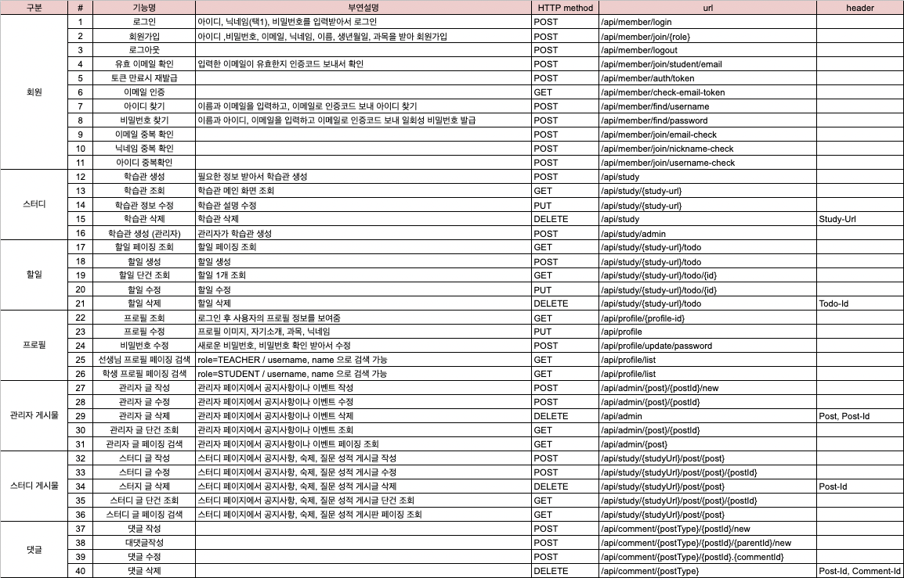
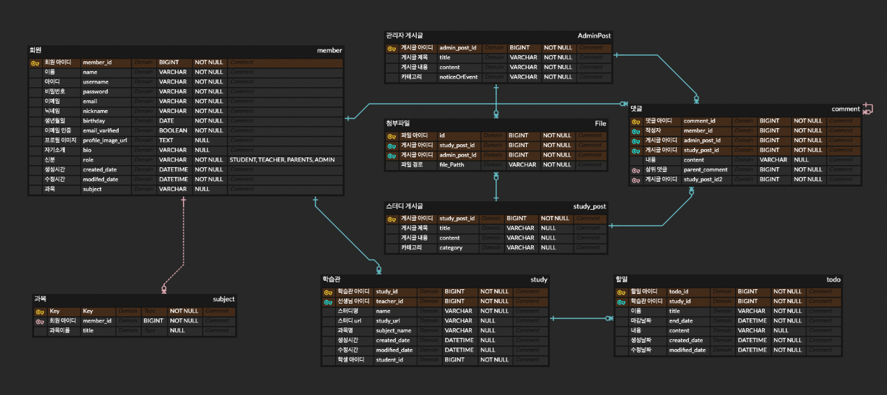

# 📝 GODtudy

## 💻 프로젝트 설명

  
>Spring Boot 강의를 수강하며 기본적인 CRUD와 회원관리(Spring Security, jwt 토큰관리)등 Spring Boot와 JPA에 대한 전반적인 이해와 공부를 하며 진행한 선생님과 학생의 개인 스터디 페이지를 만들어 스터디를 진행하도록 도와주는 선생님과 학생 1:1 스터디 매칭 프로젝트 입니다.

### 🗓 기간
2022.08.02 ~ 2022.09.18 (약 1달 반) 

### ‍🧑🏻‍💻 멤버
|                                                          최상원                                                           |                                                          유하연                                                          |
|:----------------------------------------------------------------------------------------------------------------------:|:---------------------------------------------------------------------------------------------------------------------:|
| <a href="https://github.com/CSangwon"> | <a href="https://github.com/yuhalog"> |
|                                        [@CSangwon](https://github.com/CSangwon)                                        |                                        [@yuhalog](https://github.com/yuhalog)                                         |

## ⚙️ 기능 소개
### Spring REST Docs

[GODtudy Spring REST Docs](https://rape-seed.github.io/GODtudy/)  
Spring Rest Docs를 적용해 만든 API 문서입니다.
> #### 적용한 이유?
> - 제품 코드에 영향이 없다 : 실제 제품 코드에 어노테이션을 추가하거나 다른 코드를 추가할 필요 없음 
> - 테스트를 통과해야 문서를 만들 수 있다 : 문서와 테스트를 동시에 할 수 있다.

### 핵심 기능
- 회원 관리 (jwt, 이메일 인증 등)
- 회원으로 선생님, 학생의 각각 역할로 회원가입을 진행
- 선생님은 학생을 검색한 후, 선생님과 학생의 1:1 스터디 페이지 생성
- 스터디 페이지 내에서 할일 목록, 게시판 글 작성
- 관리자는 전체 스터디에 대한 공지사항이나 이벤트 글 작성 등 모든 기능 가능

### 전체 요구사항 정의

## ERD

#### 보완 예정 사항
- study 테이블과 subject 테이블 1:1 매핑